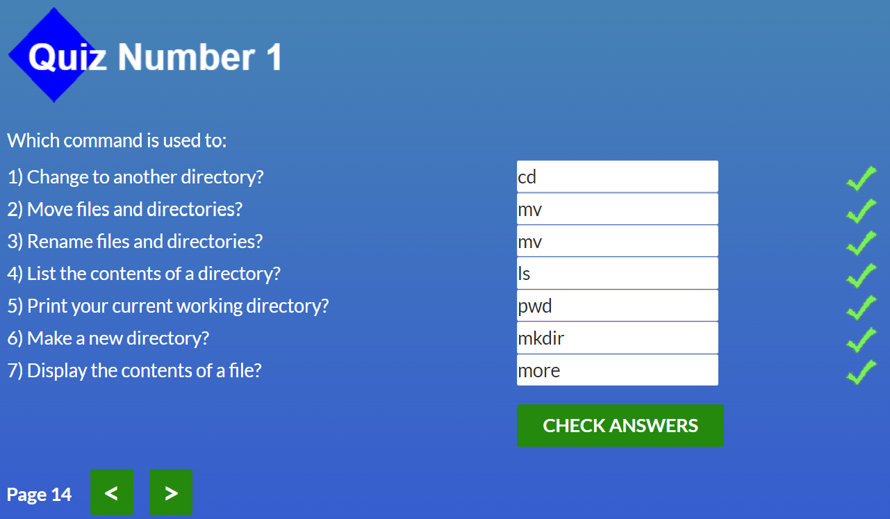
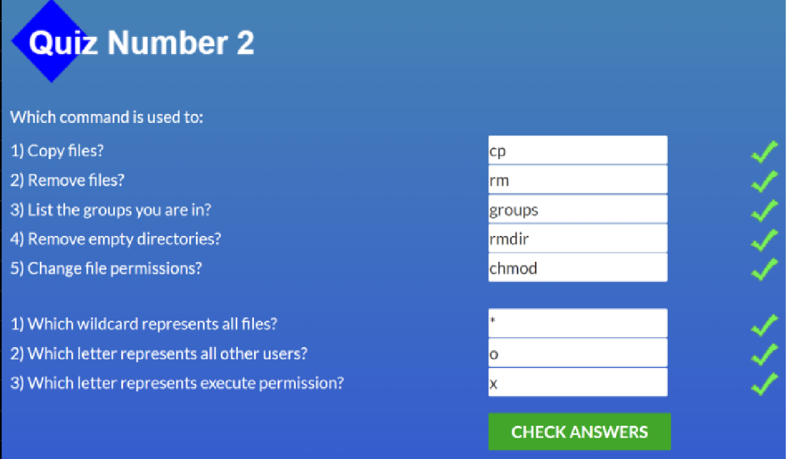
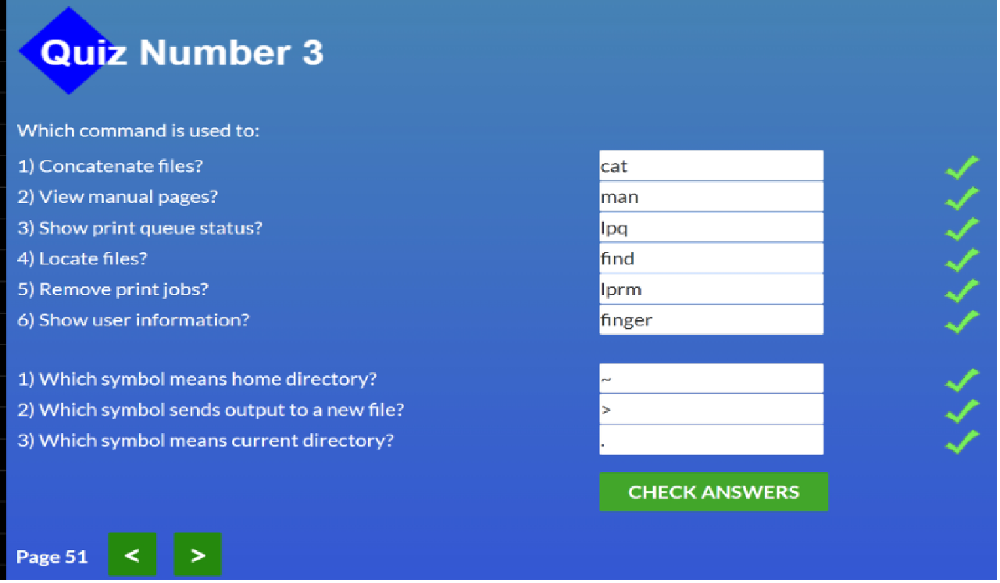
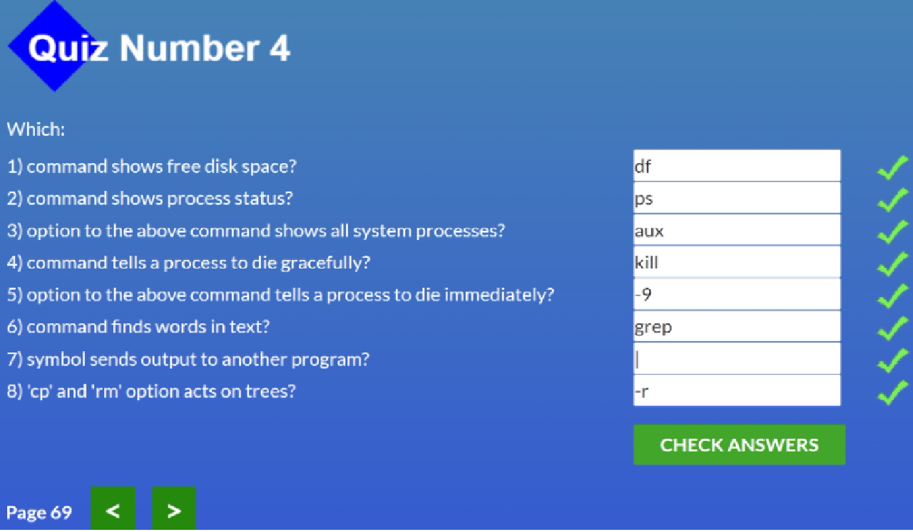

# kottans-frontend

1. Linux CLI, and HTTP

Linux: 
Для меня это все было в новинку так как я только начинаю свой путь програмистаю.             

Мне понравился формат подачи информации, хотя не обошлось без трудных моментов.   
В будущем я надеюсь что эти знания будут мне полезны.

 
Скрин 1

 

 
Скрин 2

 

 
Скрин 3

 

 
Скрин 4

  

